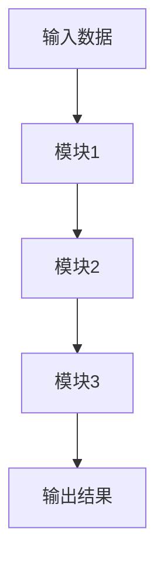

# 【发明名称】

【一种……方法/系统/装置。直接体现对象和技术手段，不写"新型""先进"等评价性词语，建议25–32字。】

## 技术领域

<!-- 字数目标：60–100字，1段 -->

[0001] 本发明涉及【大领域】领域的技术，具体是一种针对【具体对象/场景】的【核心技术手段】方法/系统。【第一次出现英文缩写时使用"中文名称(English Full Name，ABBR)"格式。】

## 背景技术

<!-- 字数目标：100–200字，1–2段 -->

[0002] 在【具体系统/应用场景】中，现有方法通常通过【现有方法的主要技术路径】实现【目标功能】，主要包括【关键步骤1】、【关键步骤2】等过程。

[0003] 然而，上述方法在【特定数据/场景/约束】下存在以下不足：【缺陷1】；【缺陷2】；【缺陷3】，导致【直接技术后果】。

## 发明内容

<!-- 字数目标：500–800字，10–12段，每段编号连续递增 -->

[0004] 本发明提出一种【发明名称】，通过【核心手段1】和【核心手段2】，实现【核心技术效果】。

本发明是通过以下技术方案实现的：

[0005] 本发明涉及一种【方法/系统】，以【输入】为输入，经【核心模块链路】处理，输出【最终结果】。

[0006] 所述的【关键输入】包括【输入项1】和【输入项2】，其中：【输入项1】是指【定义，1–2句】；【输入项2】是指【定义，1–2句】。

[0007] 所述的【核心模块1】是指：以【输入】为输入，通过【处理方式，含关键公式/参数】，输出【结果】。

[0008] 所述的【核心模块2】是指：以【上步输出】为输入，通过【处理方式】，输出【结果】。

[0009] 所述的【核心模块3/关键算法】是指：【处理过程，3句以内】。

[0010] 所述的【最终输出/恢复/推断】是指：通过【步骤/阶段】最终得到【最终结果】。

[0011] 本发明涉及一种实现上述方法的系统，包括：【模块1】、【模块2】、【模块3】和【输出模块】，其中：【模块1】用于【功能】并将【输出】传输至【模块2】；【模块2】用于【功能】并将【输出】传输至【模块3】；【输出模块】用于输出【最终结果】。

## 技术效果

<!-- 字数目标：80–150字，1段，必须含量化指标 -->

[0012] 相比现有技术【现有技术的不足】，本发明【核心优势1句话】。在【实验条件】下，本发明能够【量化效果1，如：达到X%成功率，仅需Y条迹】，较现有方法【量化对比】。本发明还可适用于【扩展场景】。

## 附图说明

<!-- 每图1行。
     ⚠️ 附图说明中"图N为…"条目数量必须与正文 Mermaid 代码块数量严格相等。
     先写 Mermaid 块，再写对应数量的图说明；不要添加无 Mermaid 块对应的图。-->

[0013] 图1为本发明方法/系统示意图。

<!-- 仅在正文具体实施方式中存在第二个 Mermaid 代码块时，才取消以下行的注释并填写：
[0014] 图2为……示意图。
-->

## 具体实施方式

<!-- 字数目标：200–400字，引言1句 + 步骤①–⑥，每步1–2句 -->

[0014] 本实施例通过【核心技术】实现【目标功能】，以【具体数据集/设备/场景】为例进行说明。

[0015] 如图1所示，本实施例具体包括以下步骤：

[0016] ①【步骤1：读取/采集/初始化，含输入和格式说明】；

[0017] ②【步骤2：第一核心模块处理，写清输入参数和输出结果】；

[0018] ③【步骤3：第二核心模块处理，写清数据流向】；

[0019] ④【步骤4：迭代/更新/融合】；

[0020] ⑤【步骤5：判断终止条件；不满足则返回④】；

[0021] ⑥【步骤6：输出最终结果，写清格式和用途】。

[0022] 整个系统中的各个模块都为本发明的核心内容，各模块的处理结果相互关联，应按照上述步骤执行。上述具体实施可由本领域技术人员在不背离本发明原理和宗旨的前提下以不同方式进行局部调整，本发明的保护范围以权利要求书为准且不由上述具体实施所限。

## 权利要求书草稿

<!-- 写法规则：
     独立权：含"其特征在于，包括以下步骤："或"包括：……"；
     从属权：含"根据权利要求N所述的方法，其特征是，……"；
     权利要求用"、"结尾（中文专利惯例），从属权指明依赖的权利要求编号。
-->

1、一种【发明名称（方法形式）】，其特征在于，包括以下步骤：
【步骤a】：……；
【步骤b】：……；
【步骤c】：……；
输出【最终结果】。

2、根据权利要求1所述的方法，其特征是，所述的【关键参数/子模块A】是指：【具体实现细节，1–2句】。

3、根据权利要求1所述的方法，其特征是，所述的【关键参数/子模块B】是指：【具体实现细节，1–2句】。

4、根据权利要求1所述的方法，其特征是，所述的【输入信号/数据类型】还可替换为【替代类型】，所述的【算法/协议】还可替换为具有【结构特征】的其他算法。

【M】、一种实现权利要求1至【M-1】中任一项所述方法的【系统/装置】，其特征在于，包括：【模块1/部件1】、【模块2/部件2】和【输出模块/输出部件】，其中：
【模块1/部件1】，用于【功能描述】并将结果传至【模块2/部件2】；
【模块2/部件2】，用于【功能描述】并将结果传至后续模块；
【输出模块/输出部件】，用于汇总输出【最终结果】。

<!-- 可选：根据发明实际内容，补充其他独立权利要求 -->
【N】、一种【……】，其特征在于，所述【……】实现权利要求1至【N-1】中任一项所述的方法。
